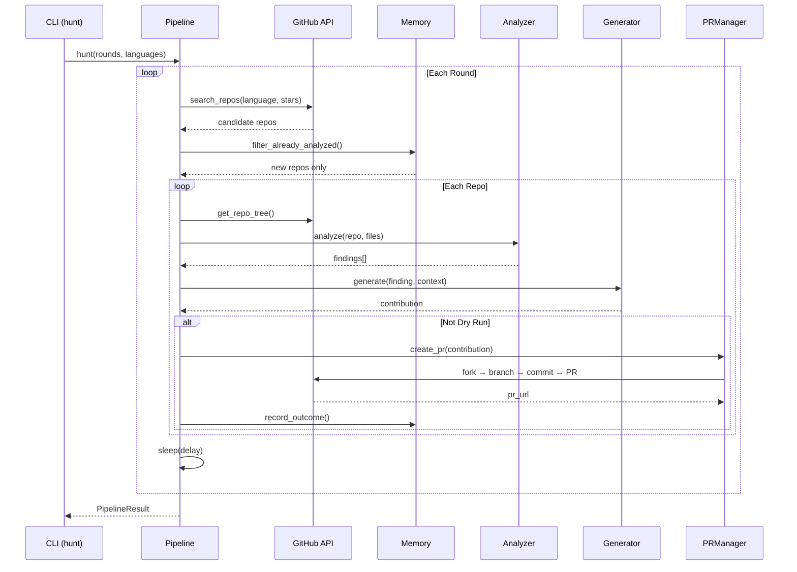

# Architecture

ContribAI v2.8.0 — DeerFlow/AgentScope-inspired agent architecture.

## System Overview

```
                           ┌─────────────────────────────┐
                           │      ContribAI Pipeline      │
                           └─────────────┬───────────────┘
                                         │
                    ┌────────────────────▼────────────────────┐
                    │         Middleware Chain (5)             │
                    │  RateLimit → Validation → Retry         │
                    │           → DCO → QualityGate           │
                    └────────────────────┬───────────────────┘
                                         │
            ┌────────────────────────────▼─────────────────────────────┐
            │                    Sub-Agent Registry                     │
            │  ┌──────────┐ ┌──────────┐ ┌────────┐ ┌────────────┐   │
            │  │ Analyzer │ │Generator │ │ Patrol │ │ Compliance │   │
            │  └────┬─────┘ └────┬─────┘ └───┬────┘ └─────┬──────┘   │
            └───────┼────────────┼───────────┼─────────────┼──────────┘
                    │            │           │             │
            ┌───────▼────┐ ┌────▼────┐ ┌────▼────┐ ┌─────▼────┐
            │   Skills   │ │  LLM    │ │ GitHub  │ │   DCO    │
            │ (17 total) │ │  Tool   │ │  Tool   │ │  Signoff │
            └────────────┘ └─────────┘ └─────────┘ └──────────┘
                    │            │           │
                    ▼            ▼           ▼
            ┌─────────────────────────────────────────┐
            │          Outcome Memory (SQLite)          │
            │  analyzed_repos │ submitted_prs           │
            │  pr_outcomes    │ repo_preferences        │
            │  findings_cache │ run_log                 │
            │  working_memory │ (auto-load/save, TTL)   │
            └─────────────────────────────────────────┘
                    │                       │
            ┌───────▼────┐         ┌────────▼────────┐
            │ EventBus   │         │ ContextCompressor│
            │ (15 events)│         │ (LLM + truncate) │
            └────────────┘         └─────────────────┘
```

## Module Map

| Module | Purpose | Key Files |
|--------|---------|-----------|
| `core/` | Config, models, middleware | `config.py`, `models.py`, `middleware.py` |
| `analysis/` | Code analysis + skills | `analyzer.py`, `skills.py` |
| `agents/` | Sub-agent registry | `registry.py` |
| `tools/` | Tool protocol + wrappers | `protocol.py` |
| `llm/` | Multi-provider LLM | `provider.py`, `context.py` |
| `github/` | GitHub API + discovery | `client.py`, `discovery.py` |
| `generator/` | Code generation + review | `engine.py`, `scorer.py` |
| `pr/` | PR management + patrol | `manager.py`, `patrol.py` |
| `orchestrator/` | Pipeline + hunt + memory | `pipeline.py`, `memory.py` |
| `issues/` | Issue solving | `solver.py` |
| `mcp/` | MCP stdio server (14 tools) | `mcp_server.py` |
| `web/` | FastAPI dashboard | `app.py`, `api.py` |
| `cli/` | CLI interface | `main.py` |

## Data Flow

### Standard Pipeline

```
1. Discovery      → GitHub Search API finds candidate repos
2. Analysis       → 7 LLM-powered analyzers run in parallel
   └── Skills     → Progressive loading by language/framework
3. Validation     → LLM deep-validates findings against file context
4. Generation     → LLM generates code fix + self-review
5. Quality Gate   → 7-check scorer (correctness, style, safety, etc.)
6. PR Creation    → Fork → Branch → Commit (with DCO) → PR
7. CI Monitor     → Auto-close PRs that fail CI
```

### Hunt Mode

```
for round in 1..N:
    1. Vary star range + languages
    2. Discover repos (random tier selection)
    3. Filter: skip analyzed, check merge history
    4. Process each repo through standard pipeline
    5. Sleep between rounds (configurable delay)
```



### PR Patrol

```
for each open PR:
    1. Fetch reviews + comments
    2. Filter bot comments (11+ known bots)
    3. Read bot context if maintainer references it
    4. Classify feedback (CODE_CHANGE, QUESTION, STYLE_FIX, etc.)
    5. Generate fix via LLM → push commit
    6. Respond to questions via LLM
```

## Middleware Chain

Middlewares run in order for every repo processing:

| Order | Middleware | Purpose |
|-------|-----------|---------|
| 1 | `RateLimitMiddleware` | Check daily PR limit + API rate |
| 2 | `ValidationMiddleware` | Validate repo data exists |
| 3 | `RetryMiddleware` | 2 retries with exponential backoff |
| 4 | `DCOMiddleware` | Compute Signed-off-by from user profile |
| 5 | `QualityGateMiddleware` | Score check (min 5.0/10) |

## Progressive Skill Loading

Skills are loaded on-demand based on detected language + framework.
Only relevant skills are injected into the LLM prompt, saving tokens.

**17 built-in skills:**

| Category | Skills |
|----------|--------|
| Universal | `security`, `code_quality` |
| Python | `python_specific`, `django_security`, `flask_security`, `fastapi_patterns` |
| JavaScript/TS | `javascript_specific`, `react_patterns`, `express_security` |
| Go | `go_specific` |
| Rust | `rust_specific` |
| Java/Kotlin | `java_specific` |
| General | `docs`, `performance`, `refactor`, `ui_ux` |

**Framework detection** auto-identifies: Django, Flask, FastAPI, Express, React, Next.js, Vue, Svelte, Angular, Spring, Rails.

## Outcome Learning

ContribAI learns from PR outcomes over time:

```sql
-- pr_outcomes: tracks every PR result
(repo, pr_number, outcome, feedback, time_to_close_hours)

-- repo_preferences: auto-computed from outcomes
(repo, preferred_types, rejected_types, merge_rate, avg_review_hours)
```

Methods:
- `record_outcome()` — called when PR is merged/closed/rejected
- `get_repo_preferences()` — returns learned preferences for a repo
- `get_rejection_patterns()` — common rejection reasons across all repos

## Sub-Agent Registry

4 built-in agents, max 3 concurrent:

| Agent | Role | Wraps |
|-------|------|-------|
| `AnalyzerAgent` | Code analysis | `CodeAnalyzer` |
| `GeneratorAgent` | Fix generation | `ContributionGenerator` |
| `PatrolAgent` | PR monitoring | `PRPatrol` |
| `ComplianceAgent` | CLA/DCO/CI | `PRManager` |

## Tool Protocol

MCP-inspired tool interface:

```python
class Tool(Protocol):
    name: str
    description: str
    async def execute(**kwargs) -> ToolResult

# Built-in tools:
# - GitHubTool: repos, files, PRs, issues, reviews
# - LLMTool: completion, analysis, classification
```

## Database Schema

SQLite with 6 tables:

| Table | Purpose |
|-------|---------|
| `analyzed_repos` | Track which repos have been analyzed |
| `submitted_prs` | All PRs created by ContribAI |
| `findings_cache` | Cached analysis findings |
| `run_log` | Pipeline run history |
| `pr_outcomes` | PR merge/rejection outcomes (v2.4.0) |
| `repo_preferences` | Learned repo preferences (v2.4.0) |

## Configuration

See `config.yaml` — key sections:

```yaml
github:        # Token, rate limits, max PRs per day
llm:           # Provider, model, API key, temperature
discovery:     # Languages, star range, activity filter
analysis:      # Enabled analyzers, max file size, skip patterns
contribution:  # PR style, commit format
pipeline:      # Concurrent repos, retry settings
multi_model:   # Task routing strategy
```

## Troubleshooting

| Symptom | Cause | Fix |
|---------|-------|-----|
| `AttributeError: 'Finding' has no attribute 'contribution_type'` | `Finding` uses `.type`, `Contribution` uses `.contribution_type` | Use `finding.type` for Finding objects |
| `429 RESOURCE_EXHAUSTED` during hunt | Gemini API rate limit (multi-round hunts) | `rate_limit_retry` (v2.4.1) auto-retries 5x with 10-120s backoff |
| Hunt returns 0 repos after first run | Memory dedup filters already-analyzed repos | Delete `~/.contribai/memory.db` or wait for new repos |
| `gh release create` hangs in PowerShell | Backticks in `--notes` confuse PS parser | Use `--notes-file /tmp/notes.md` instead |
| Coverage drops below 50% | New modules added without tests | Add tests in `tests/unit/test_<module>.py` |
| Rich output invisible when piped | Rich buffers to file | Check file size to confirm progress |

